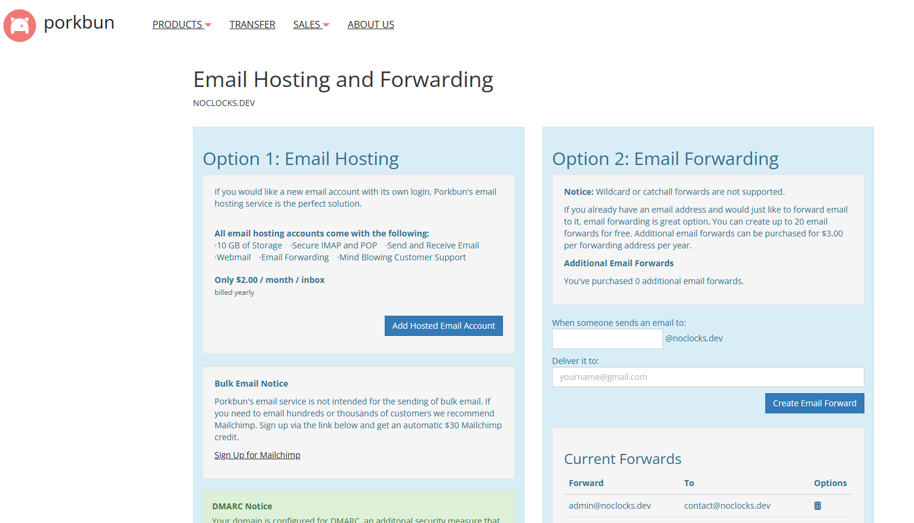
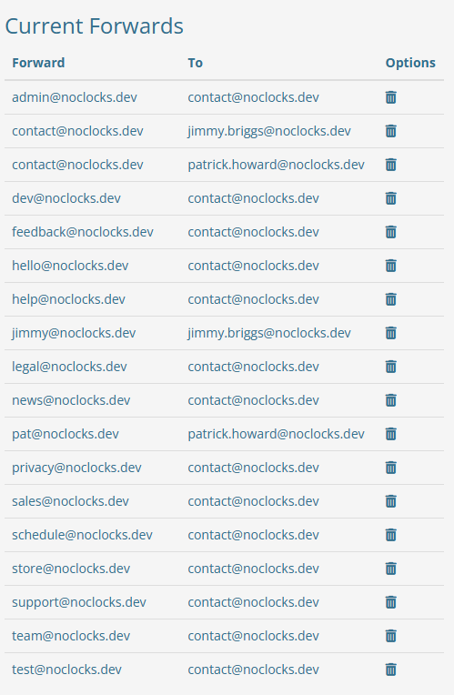

# Email Forwarding Aliases

Email forwarding aliases allow you to forward emails sent to one email address to another email address. This is useful if you have multiple email addresses and want to consolidate them into one inbox.

From a business standpoint, email forwarding aliases can be used to create various email addresses for different departments or teams. For example, you could have an email address for sales, support, and billing, and have emails sent to those addresses forwarded to the appropriate team members.

## Creating Email Forwarding Aliases

> **Note:** The process for creating email forwarding aliases will vary depending on your email provider / domain registrar.

Since we use [Porkbub](https://porkbun.com) for our domain registration, we will use their email forwarding service to create email forwarding aliases.



1. Log in to your Porkbun account.
2. Navigate to [https://porkbun.com/account/emailhosting/noclocks.dev](https://porkbun.com/account/emailhosting/noclocks.dev).
3. Add new email forwarding aliases in the "Option 2: Email Forwarding" area on the page.
4. Save Changes by clicking "Create Email Forward" Button

## Email Forwarding Strategy

At No Clocks, we have configured email forwarding aliases to forward email sent to various aliases to always forward emails to a shared, "root" email address [contact@noclocks.dev](mailto:contact@noclocks.dev) which, in turn, forwards the emails to both members of our team.

This allows us to both receive and respond to emails sent to any of the aliases.

Additionally, we have set up some short-hand versions of our full, personal email addresses for convenience. For example, emails sent to [pat@noclocks.dev](mailto:pat@noclocks.dev) will be forwarded to <patrick.howars@noclocks.dev> and emails sent to [jimmy@noclocks.dev](mailto:jimmy@noclocks.dev) will be forwarded to <jimmy.briggs@noclocks.dev>.

### Graphical Representation

Here is a graphical representation of our email forwarding strategy flow:

```mermaid
graph LR
    subgraph "Email Aliases"
      admin[admin@noclocks.dev]
      contact[contact@noclocks.dev]
      dev[dev@noclocks.dev]
      feedback[feedback@noclocks.dev]
      hello[hello@noclocks.dev]
      help[help@@noclocks.dev]
      legal[legal@noclocks.dev]
      news[news@noclocks.dev]
      privacy[privacy@noclocks.dev]
      sales[sales@noclocks.dev]
      schedule[schedule@noclocks.dev]
      store[store@noclocks.dev]
      support[support@noclocks.dev]
      team[team@noclocks.dev]
      test[test@noclocks.dev]
    end

    subgraph ra["Root Alias"]
      root[contact@noclocks.dev]
    end

    subgraph "Team Members"

      jimmybriggs[jimmy.briggs@noclocks.dev]
      patrickhoward[patrick.howard@noclocks.dev]

    end

    admin --> root
    contact --> root
    dev --> root
    feedback --> root
    hello --> root
    help --> root
    legal --> root
    news --> root
    privacy --> root
    sales --> root
    schedule --> root
    store --> root
    support --> root
    team --> root
    test --> root

    root --> jimmybriggs
    root --> patrickhoward
```

As you can see, emails sent to any of the email forwarding aliases will be forwarded to the shared root email address, which will then forward the emails to both team members.

## Current Email Forwarding Aliases

Here are the current email forwarding aliases we have set up for our domain:

|        Forward        |             To              |
|:---------------------:|:---------------------------:|
|  admin@noclocks.dev   |    contact@noclocks.dev     |
| contact@noclocks.dev  |  jimmy.briggs@noclocks.dev  |
| contact@noclocks.dev  | patrick.howard@noclocks.dev |
|   dev@noclocks.dev    |    contact@noclocks.dev     |
| feedback@noclocks.dev |    contact@noclocks.dev     |
|  hello@noclocks.dev   |    contact@noclocks.dev     |
|   help@noclocks.dev   |    contact@noclocks.dev     |
|  jimmy@noclocks.dev   |  jimmy.briggs@noclocks.dev  |
|  legal@noclocks.dev   |    contact@noclocks.dev     |
|   news@noclocks.dev   |    contact@noclocks.dev     |
|   pat@noclocks.dev    | patrick.howard@noclocks.dev |
| privacy@noclocks.dev  |    contact@noclocks.dev     |
|  sales@noclocks.dev   |    contact@noclocks.dev     |
| schedule@noclocks.dev |    contact@noclocks.dev     |
|  store@noclocks.dev   |    contact@noclocks.dev     |
| support@noclocks.dev  |    contact@noclocks.dev     |
|   team@noclocks.dev   |    contact@noclocks.dev     |
|   test@noclocks.dev   |    contact@noclocks.dev     |

And here is a screenshot of the email forwarding aliases we have set up in Porkbun:



## Conclusion

Email forwarding aliases are a powerful tool that can help you manage multiple email addresses and consolidate them into one inbox. By setting up email forwarding aliases, you can create different email addresses for different purposes and have all emails sent to those addresses forwarded to a central inbox.

***

[No Clocks, LLC](https://github.com/noclocks) | 2024
